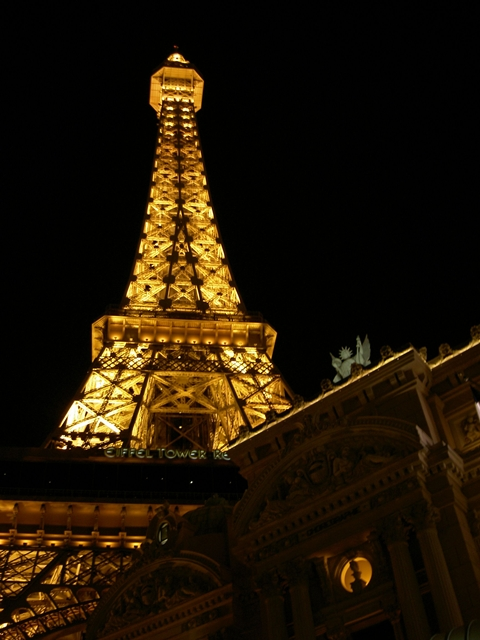
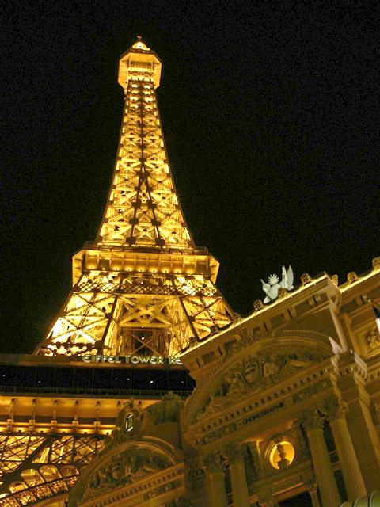
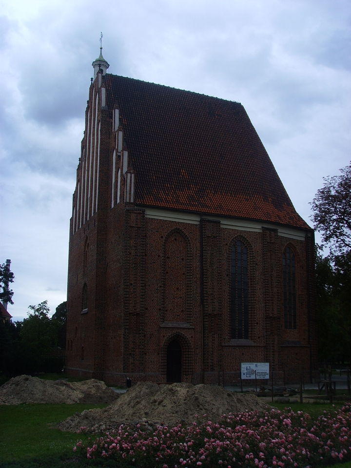
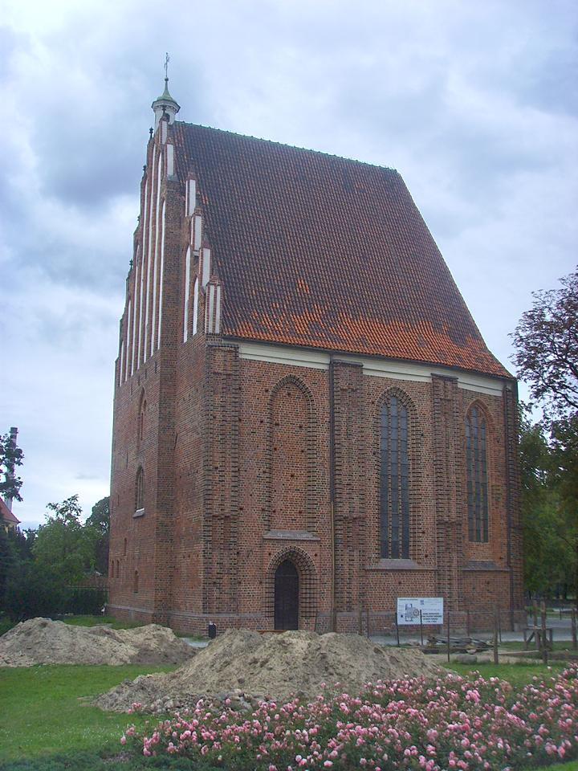

# Image-Contrast-Enhancement

Python implementations of various image contrast enhancement algorithms including:
- Histogram Equalization (HE)
- Dynamic Histogram Equalization (DHE)
- A New Image Contrast Enhancement Algorithm Using Exposure Fusion Framework

## Implemented Algorithms

### 1. Histogram Equalization (HE)
Histogram Equalization enhances the contrast of an image by transforming the values in an intensity image so that the histogram of the output image is approximately equalized.

### 2. Dynamic Histogram Equalization (DHE)
Dynamic Histogram Equalization modifies the histogram equalization technique by partitioning the image histogram and equalizing each part independently to enhance the contrast while preserving the natural appearance of the image.

### 3. A New Image Contrast Enhancement Algorithm Using Exposure Fusion Framework
This method, proposed in "[A New Image Contrast Enhancement Algorithm Using Exposure Fusion Framework](https://baidut.github.io/OpenCE/caip2017.html)", enhances contrast by applying an exposure fusion framework to combine multiple images with different exposures into a single enhanced image.

## Requirements

To run these implementations, the following Python libraries are required:
- `scipy`
- `numpy`
- `imageio`
- `matplotlib`
- `cv2` (OpenCV)
- `skimage`

You can install these dependencies using pip:
```sh
pip install scipy numpy imageio matplotlib opencv-python-headless scikit-image
```
```sh
Dataset: TM-DIED - 222 JPEG photos constituting some of the most challenging cases for image enhancement and tone-mapping algorithms
```

## Usage

### 1. Histogram Equalization (HE)
To apply histogram equalization on an input image:
```sh
python he.py <input image>
```

### 2. Dynamic Histogram Equalization (DHE)
To apply dynamic histogram equalization on an input image:
```sh
python dhe.py <input image>
```

### 3. A New Image Contrast Enhancement Algorithm Using Exposure Fusion Framework
To apply the contrast enhancement algorithm using the exposure fusion framework on an input image:
```sh
python ying.py <input image>
```

## Example Results

### Original vs Enhanced (Exposure Fusion Framework)
<p align='center'>
  
  
  
  
</p>

<p align='center'>
  
  
</p>

<p align='center'>
  
  
</p>

## Detailed Implementation Descriptions

### Histogram Equalization (HE)
Histogram equalization is implemented to enhance image contrast. The code reads an image, computes the histogram of pixel values, equalizes the histogram, and applies the equalized histogram to transform the input image.

### Dynamic Histogram Equalization (DHE)
Dynamic Histogram Equalization enhances contrast by dividing the histogram of the image into sub-histograms and applying histogram equalization to each sub-histogram separately. This method improves the contrast while preserving brightness details, which is especially useful for images with varying intensity distributions.

### A New Image Contrast Enhancement Algorithm Using Exposure Fusion Framework
This algorithm is based on the exposure fusion framework that combines multiple images with different exposures to create a single image with enhanced contrast. The process involves the following steps:
1. **Decomposition**: The input image is decomposed into several exposure images.
2. **Weight Map Calculation**: Weight maps for each exposure image are calculated based on different criteria such as contrast, saturation, and well-exposedness.
3. **Fusion**: The final image is obtained by fusing the exposure images using the calculated weight maps.

## Code Structure

### `he.py`
This script contains the implementation of the Histogram Equalization algorithm. It reads the input image, computes the histogram, applies equalization, and saves the enhanced image.

### `dhe.py`
This script contains the implementation of the Dynamic Histogram Equalization algorithm. It partitions the histogram, equalizes each part, and transforms the input image to enhance contrast.

### `ying.py`
This script implements the new image contrast enhancement algorithm using the exposure fusion framework. It generates multiple exposure images, calculates weight maps, and fuses them to create the final enhanced image.

## Examples

To run the Histogram Equalization algorithm on an image:
```sh
python he.py testdata/01.jpg
```

To run the Dynamic Histogram Equalization algorithm on an image:
```sh
python dhe.py testdata/02.jpg
```

To run the new contrast enhancement algorithm using the exposure fusion framework on an image:
```sh
python ying.py testdata/03.jpg
```

## References

1. Histogram Equalization: [Wikipedia](https://en.wikipedia.org/wiki/Histogram_equalization)
2. Dynamic Histogram Equalization: "[A Dynamic Histogram Equalization for Image Contrast Enhancement](https://ieeexplore.ieee.org/document/4266947/)"
3. Exposure Fusion Framework: "[A New Image Contrast Enhancement Algorithm Using Exposure Fusion Framework](https://baidut.github.io/OpenCE/caip2017.html)"

